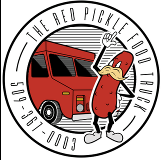

# FreshBook.me

Freshbook.me is our teams take on a scheduling app intended for scheduling and managing employees.
Our application will ideal allow for the rapid generation and adaptation of work schedules depending
on employee availability and competency.

# Client

Our client is the Red Pickle, a restaurant local to Ellensburg. The Red Pickles is a small
locally owned business that our group wanted to provide our services to as software engineers.

# Project Components

* Python 
* SQLite3
* Flask
* Figma
* React